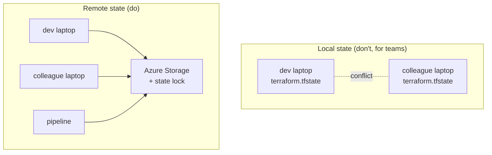
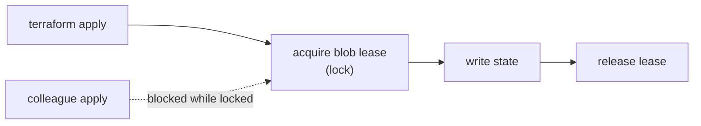

# The Azure Provider and Remote State

Everything so far kept Terraform **state** in a local `terraform.tfstate` file — fine for a solo lab, dangerous for a team. This page configures the `azurerm` provider properly and moves state into a **remote backend** in Azure Storage, so state is shared, locked, and never sits as a secret-bearing file on your laptop. This is the single most important step for using Terraform beyond one person.

## Why remote state



| Problem with local state | Remote backend fix |
|---|---|
| Secrets in a file on disk | Stored in access-controlled Azure Storage |
| Two people apply at once → corruption | **State locking** (one writer at a time) |
| Laptop lost = state lost | Durable, versioned blob storage |
| Pipeline can't see your state | Shared backend all runners read |

## Step 1 — Configure the provider with required versions

Pin both Terraform and provider versions in **`terraform.tf`** (a conventional split from `main.tf`):

```hcl
terraform {
  required_version = ">= 1.6"

  required_providers {
    azurerm = {
      source  = "hashicorp/azurerm"
      version = "~> 4.0"
    }
  }
}

provider "azurerm" {
  features {}
  subscription_id = var.subscription_id
}
```

## Step 2 — Create the state storage (a one-time bootstrap)

The backend storage must exist *before* Terraform can use it — a chicken-and-egg you solve once with the Azure CLI. Provision a dedicated resource group, a storage account, and a **blob container** for state files:

```powershell
$rg      = "rg-terraform-state"
$account = "stshoppingtfstate$(Get-Random -Maximum 9999)"   # must be globally unique, lowercase
$location = "westeurope"

az group create --name $rg --location $location

az storage account create `
  --name $account --resource-group $rg --location $location `
  --sku Standard_LRS --kind StorageV2 --min-tls-version TLS1_2 `
  --allow-blob-public-access false

az storage container create `
  --name tfstate --account-name $account --auth-mode login
```

!!! note

    **Naming conventions matter** for global-unique resources. Storage account names are 3–24 chars, lowercase, no hyphens. A convention like `st<workload>tfstate` keeps them recognisable. Azure's recommended abbreviations (`rg-`, `st`, `kv-`, `vnet-`) are listed in [Microsoft's naming guide](https://learn.microsoft.com/en-us/azure/cloud-adoption-framework/ready/azure-best-practices/resource-abbreviations).

## Step 3 — Point Terraform at the backend

Add a `backend "azurerm"` block to the `terraform {}` block:

```hcl
terraform {
  required_version = ">= 1.6"
  required_providers {
    azurerm = { source = "hashicorp/azurerm", version = "~> 4.0" }
  }

  backend "azurerm" {
    resource_group_name  = "rg-terraform-state"
    storage_account_name = "stshoppingtfstateNNNN"   # the name you created
    container_name       = "tfstate"
    key                  = "shopping.dev.tfstate"     # the blob (state file) name
  }
}
```

Then **migrate** the existing local state to the backend — `init` offers to copy it:

```powershell
terraform init      # detects the backend, asks to migrate local state -> Azure
```

```text
Initializing the backend...
Do you want to copy existing state to the new backend? ... yes
Successfully configured the backend "azurerm"!
```

!!! warning

    After migration, **delete the local `terraform.tfstate`** (it's now stale) and confirm `terraform.tfstate` is git-ignored. The blob in Azure Storage is now the single source of truth, with locking handled automatically via blob leases.

## Step 4 — State locking and the backend deep dive

When you run `apply`, the `azurerm` backend takes a **lease** on the state blob. Anyone else who runs `apply` gets *"Error acquiring the state lock"* until you're done — preventing two concurrent writers from corrupting state.



| Backend behaviour | Detail |
|---|---|
| **Locking** | Automatic via Azure blob lease |
| **Versioning** | Enable blob versioning on the account for state history/rollback |
| **Isolation** | One `key` (blob) per environment: `shopping.dev.tfstate`, `shopping.prod.tfstate` |
| **Access control** | RBAC on the storage account = who can touch state |

!!! note

    Separating environments by **`key`** (blob name) — or by [workspace](6-Loops-Conditionals-and-Workspaces.md) — keeps dev and prod state apart while sharing one config. Pick one strategy and stick to it.

## Step 5 — Running Terraform from Azure Pipelines (tie-in)

For automation, the same backend lets an Azure DevOps pipeline run Terraform — the natural bridge back to this guide's CI/CD theme. Authenticate via a service connection (as in the [Bicep module](../6-Infrastructure-as-Code-with-Bicep/2-Setup-Service-Connection-and-Structure.md)) and run init/plan/apply as tasks:

```yaml
steps:
  - task: AzureCLI@2
    displayName: Terraform plan
    inputs:
      azureSubscription: sc-shopping-infra
      scriptType: pscore
      scriptLocation: inlineScript
      inlineScript: |
        terraform init
        terraform plan -var-file="dev.tfvars" -out=tfplan
  # An approval gate (Environments) then runs `terraform apply tfplan`
```

!!! tip

    Gate `terraform apply` behind an [Environment approval](../3-Azure-Yaml-Pipelines/15-Environments-and-Pre-Deployment-Approvals.md) and have the pipeline service principal hold **least-privilege** RBAC on the subscription — the same security posture as the rest of this guide.

With a solid provider and shared, locked state, we can build real shared services on top. Next: Log Analytics, Key Vault, and RBAC.

!!! tip

    **References:**

    - [azurerm backend (HashiCorp)](https://developer.hashicorp.com/terraform/language/settings/backends/azurerm)
    - [Store Terraform state in Azure Storage (Microsoft)](https://learn.microsoft.com/en-us/azure/developer/terraform/store-state-in-azure-storage)
    - [State locking (HashiCorp)](https://developer.hashicorp.com/terraform/language/state/locking)
