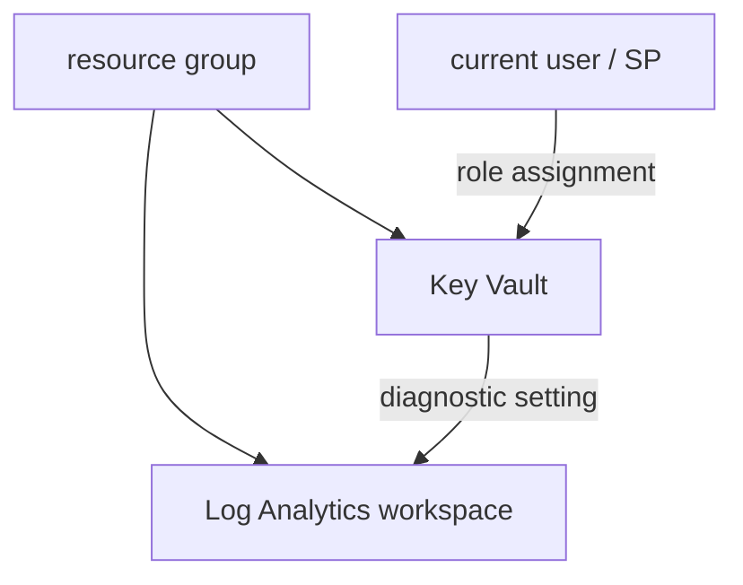

# Shared Services: Log Analytics, Key Vault, and RBAC

With remote state in place, we provision the **shared services** every workload leans on: a **Log Analytics workspace** for observability, a **Key Vault** for secrets, and the **RBAC** role assignments that grant access. These are the same resources we built in [Bicep](../6-Infrastructure-as-Code-with-Bicep/4-Log-Analytics-Bicep-Template-and-Module.md) — seeing them in Terraform side-by-side is the fastest way to internalise both tools.

## What we build



!!! note

    **Compartmentalising shared services.** Observability (Log Analytics) and secrets (Key Vault) are typically *shared* across many workloads, so teams often put them in their own resource group/state, separate from per-app infrastructure. We keep them together here for clarity, but the module boundaries below make splitting them later trivial.

## Step 1 — Log Analytics workspace

```hcl
resource "azurerm_log_analytics_workspace" "main" {
  name                = "log-shopping-${var.environment}"
  resource_group_name = azurerm_resource_group.main.name
  location            = var.location
  sku                 = "PerGB2018"
  retention_in_days   = 30
  tags                = local.common_tags
}
```

Compare to the [Bicep equivalent](../6-Infrastructure-as-Code-with-Bicep/4-Log-Analytics-Bicep-Template-and-Module.md): same resource, same SKU and retention — Terraform's `azurerm_log_analytics_workspace` versus Bicep's `Microsoft.OperationalInsights/workspaces`. The concepts transfer one-to-one.

## Step 2 — Get the current user context

To assign yourself access to Key Vault, Terraform needs to know *who is running it*. The `azurerm_client_config` **data source** reads the current identity (no resource created):

```hcl
data "azurerm_client_config" "current" {}
# Exposes: tenant_id, object_id (the running user/SP), subscription_id
```

!!! tip

    A **data source** (`data "..."`) *reads* existing information rather than creating a resource. `azurerm_client_config` is the standard way to get the caller's `tenant_id` and `object_id` for role and access-policy assignments.

## Step 3 — Key Vault with RBAC authorization

Modern Key Vaults use **Azure RBAC** for data-plane access (instead of legacy access policies). Set `enable_rbac_authorization = true`:

```hcl
resource "azurerm_key_vault" "main" {
  name                       = "kv-shopping-${var.environment}"
  resource_group_name        = azurerm_resource_group.main.name
  location                   = var.location
  tenant_id                  = data.azurerm_client_config.current.tenant_id
  sku_name                   = "standard"
  enable_rbac_authorization  = true     # RBAC, not access policies
  purge_protection_enabled   = true
  tags                       = local.common_tags
}
```

## Step 4 — Grant access with a role assignment

With RBAC enabled, you need a **role assignment** to read/write secrets. Grant the current user the *Key Vault Secrets Officer* role scoped to the vault:

```hcl
resource "azurerm_role_assignment" "kv_secrets" {
  scope                = azurerm_key_vault.main.id
  role_definition_name = "Key Vault Secrets Officer"
  principal_id         = data.azurerm_client_config.current.object_id
}
```

`scope` + `role_definition_name` + `principal_id` is the universal shape of an Azure role assignment — the same block grants a VM's managed identity access later, or a pipeline service principal access to a subscription.

## Step 5 — Store a secret

Once the role assignment exists, Terraform can write secrets. Note the **explicit dependency** so the role lands before the secret write:

```hcl
resource "azurerm_key_vault_secret" "db_password" {
  name         = "db-password"
  value        = var.db_password          # sensitive variable (see page 5)
  key_vault_id = azurerm_key_vault.main.id

  depends_on = [azurerm_role_assignment.kv_secrets]   # role must exist first
}
```

!!! warning

    RBAC role assignments can take **30–60 seconds to propagate**. If a secret write fails with a permissions error right after creating the assignment, it's usually propagation lag — `depends_on` orders the operations, but a re-`apply` may still be needed on first run.

## Step 6 — Diagnostic settings → Log Analytics

Route the Key Vault's logs and metrics to Log Analytics — the same wiring as the Bicep [Data Factory diagnostics](../6-Infrastructure-as-Code-with-Bicep/8-Data-Factory-Bicep-Module.md):

```hcl
resource "azurerm_monitor_diagnostic_setting" "kv" {
  name                       = "send-to-log-analytics"
  target_resource_id         = azurerm_key_vault.main.id
  log_analytics_workspace_id = azurerm_log_analytics_workspace.main.id

  enabled_log { category_group = "allLogs" }
  metric      { category = "AllMetrics" }
}
```

!!! tip

    Not sure which log categories a resource supports? Configure a diagnostic setting **once in the Azure Portal**, then read back the categories it offers — that tells you exactly what to put in `enabled_log`. The portal is a discovery tool; Terraform is the source of truth.

## Verify

```powershell
terraform apply -var-file="dev.tfvars"

az keyvault show --name kv-shopping-dev --query "properties.enableRbacAuthorization"
az monitor diagnostic-settings list --resource $(az keyvault show -n kv-shopping-dev --query id -o tsv) -o table
```

You now have observability and secrets management as code. Next we build the compute and networking layer — a virtual network, a Linux VM, and a Bastion host.

!!! tip

    **References:**

    - [azurerm_key_vault (Registry)](https://registry.terraform.io/providers/hashicorp/azurerm/latest/docs/resources/key_vault)
    - [azurerm_role_assignment (Registry)](https://registry.terraform.io/providers/hashicorp/azurerm/latest/docs/resources/role_assignment)
    - [azurerm_monitor_diagnostic_setting (Registry)](https://registry.terraform.io/providers/hashicorp/azurerm/latest/docs/resources/monitor_diagnostic_setting)
